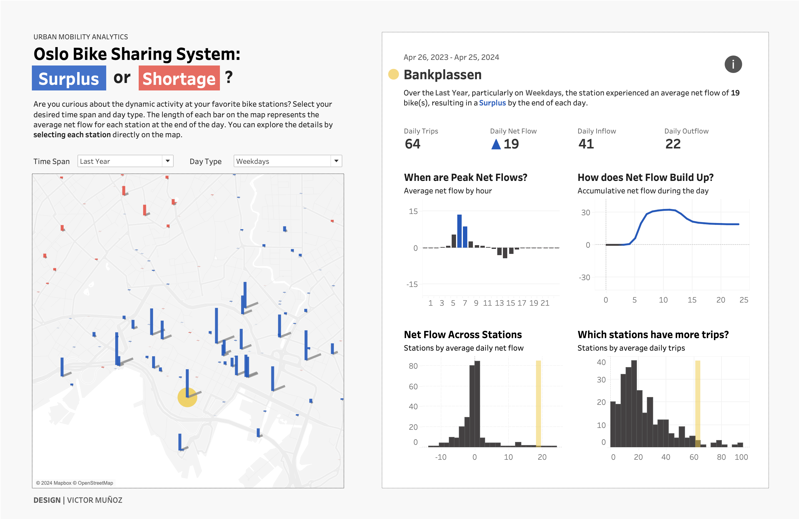
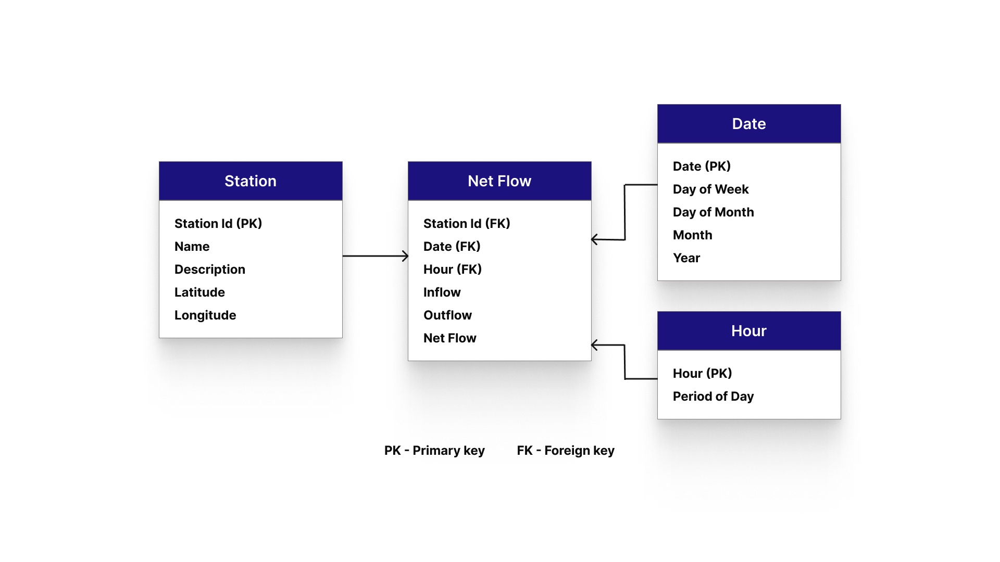
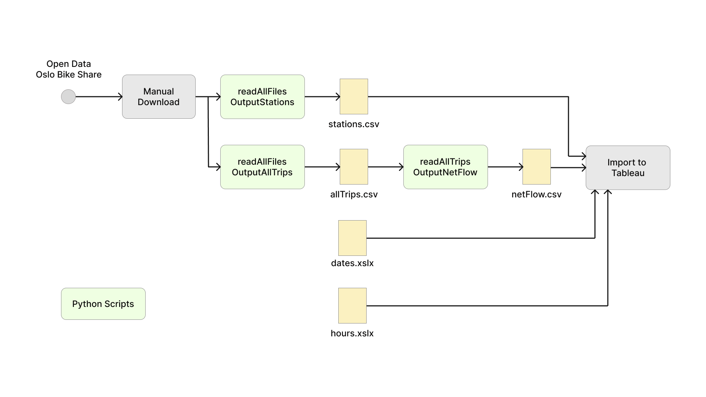
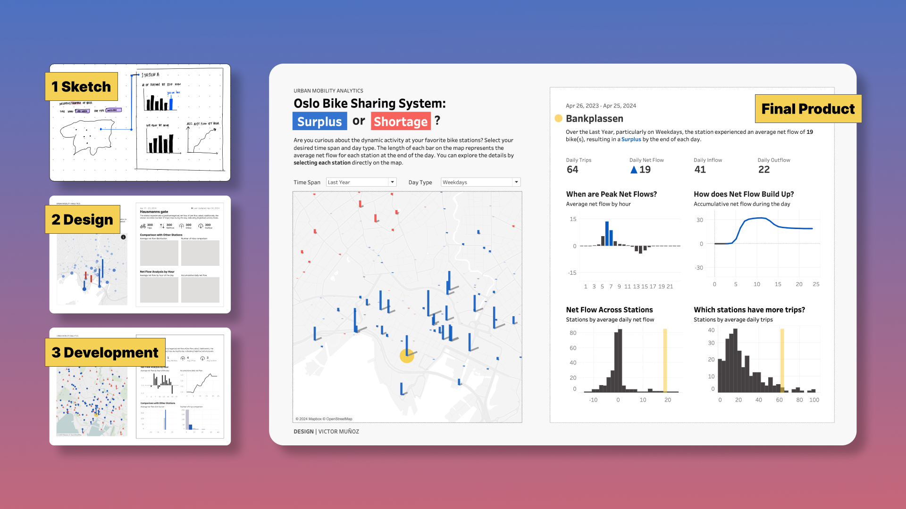

# Oslo Bike Sharing System Analysis
Welcome to the Oslo Bike Sharing System Analysis repository! This project aims to explore the dynamics of the bike-sharing system in Oslo, and to provide insights that can help improve the overall experience for bike-sharing users in Oslo.

## Summary
The main objective of the project was to optimize bike distribution to ensure sufficient availability at high-demand stations during peak hours. The project outcome is a dashboard highlighting the stations with the highest values for shortage and surplus at the end of each day, and the build-up of peak hours throughout the day. By using this visualization, users can identify the priority stations for intervention and determine the optimal visit times and bike quantities for distribution. You can visit the dashboard in the following [link.](https://public.tableau.com/app/profile/munozdataviz/viz/OsloBikeShare/NetFlow)

## Data Model
The project utilizes data obtained from the Open Data Oslo City Bike platform. The dataset includes information such as station locations, bike availability, trip durations, and usage patterns. This data serves as the foundation for our analysis and visualization efforts.

## Pipeline
The analysis pipeline consists of several stages:

- Data Acquisition: I collect data from the Open Data Oslo City Bike platform, ensuring it is up-to-date and relevant for our analysis.
- Data Preparation: The acquired data is cleaned, processed, and transformed into a format suitable for analysis.
- Dashboard Design: Based on the insights gained from EDA, I design interactive dashboards using Tableau Public. These dashboards visualize key metrics and trends, providing stakeholders with a user-friendly interface to explore the data.

## Dashboard Design Process
The design of the interactive dashboards follows a structured process:

- Requirements Gathering: I gather requirements from stakeholders to understand their needs and objectives.
- Sketching and Wireframing: I sketch initial concepts and create wireframes to visualize the layout and functionality of the dashboards.
- Design Iteration: I iterate on the design based on feedback from stakeholders, refining the layout, visual elements, and interactivity.
- Development: Once the design is finalized, I develop the dashboards using Tableau Public, implementing the necessary visualizations and interactive features.

## Repository Structure
- data/: Contains the raw and processed data used in the analysis.
- scripts/: Includes Python scripts for data preparation.
- visualization/: Contains the screenshots of all the steps in the design process.
- diagrams/: Image files used in the README and documentation.
